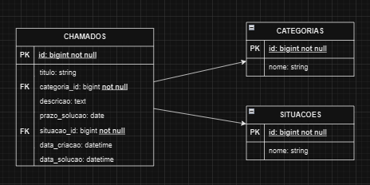
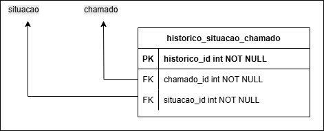

# Projeto: Sistema de Gerenciamento de Chamados de Atendimento ao Cliente

O objetivo deste projeto é desenvolver um sistema web para gerenciar chamados de atendimento ao cliente de forma simples e eficiente. A seguir, apresentamos um diagrama relacional que ilustra a estrutura do banco de dados planejada para este sistema

#### MAIN SCHEMA	 

#### INTERMEDIATE SCHEMA	 

#### Pré-requisitos para Build

Certifique-se de ter os seguintes softwares instalados e configurados em seu ambiente de desenvolvimento:

- **PHP:** Versão 8.11.29 ou superior.
- **Configuração do PHP:** A extensão `pdo_mysql` deve estar habilitada no arquivo de configuração `php.ini` (geralmente localizado em `C:\Program Files\php\...\php.ini`). Certifique-se de remover o `;` do início da linha `extension=pdo_mysql`.
- **Laravel:** Versão 4.5 ou superior.
- **Composer:** Versão 2.8 ou superior.

## Build Steps

Siga estas etapas para construir e executar a aplicação:

1. **Clone o Repositório:**

   ```bash
   git clone <URL_DO_SEU_REPOSITORIO>
   ```
   (Substitua `<URL_DO_SEU_REPOSITORIO>` pela URL real do seu repositório)
2. **Navegue até a Pasta da Aplicação:**

   ```bash
   cd chamados_app
   ```
3. **Instale as Dependências:**
   Na pasta raiz do projeto, execute o seguinte comando para instalar todas as dependências listadas no arquivo `composer.json`:

   ```bash
   composer install
   ```
4. **Crie o Banco de Dados MySQL:**
   Utilize o MySQL para criar um novo banco de dados chamado `chamados_db`. Você pode fazer isso através de uma ferramenta de administração de banco de dados (como phpMyAdmin, Dbeaver, etc.) ou executando a seguinte query diretamente no MySQL:

   ```sql
   CREATE DATABASE chamados_db;
   ```
5. **Execute as Migrações e Seeders:**
   Na pasta raiz da aplicação, execute os seguintes comandos do Artisan para criar as tabelas no banco de dados e popular com dados iniciais (se houver):

   ```bash
   php artisan migrate
   php artisan db:seed
   ```
6. **Inicie o Servidor de Desenvolvimento:**
   Para iniciar o servidor de desenvolvimento do Laravel, execute o seguinte comando:

   ```bash
   php artisan serve
   ```
   Isso iniciará um servidor local que geralmente estará disponível em `http://localhost:8000`.
